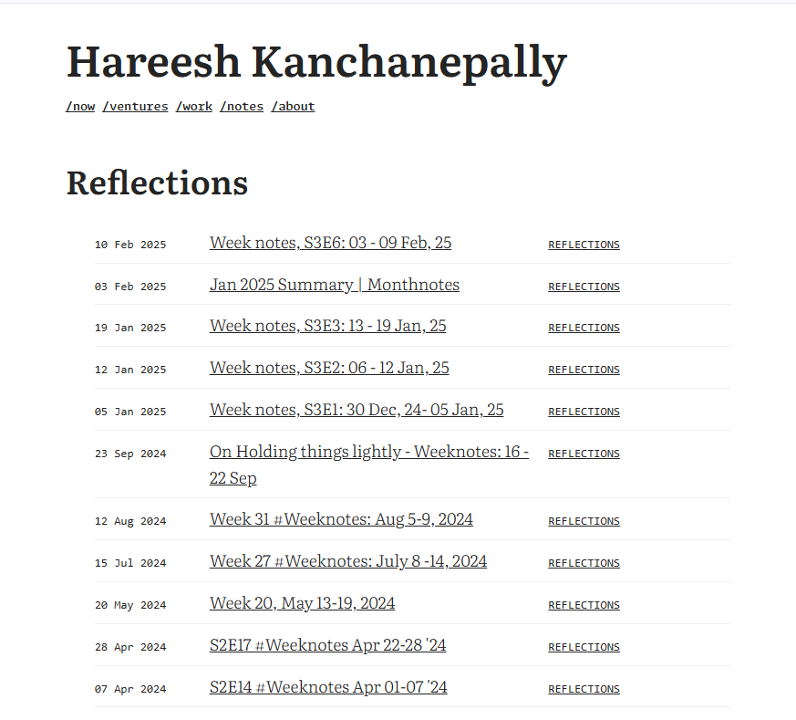
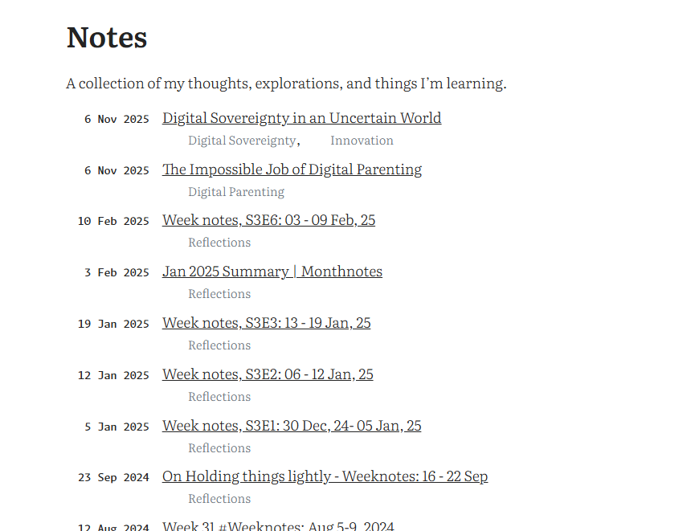

# Personal Website Launch Checklist

This document outlines the final steps to prepare your new Hugo site for launch and to go live with your custom domain.

## 1. Pre-Launch Checklist (To Do)

These steps should be completed before you deploy the site and change your domain.

### A. Finalize the 'About' Page

- [ ] **Review and Approve:** I have proposed new content for your `About` page (`content/about.md`) based on your "Beliefs" and "Start Here" pages. Please review this new content and let me know if you'd like any final adjustments.

### B. Prepare Migrated Posts for Publication

For each of your 33 migrated posts in the `content/notes/` directory, please follow these steps. This ensures they will appear on the live site and are formatted correctly.

- [ ] **Open the post's `index.md` file.**
- [ ] **Add `draft: false`:** In the front matter (the section between `---`), add the line `draft: false`. This is critical for the post to be published on Vercel.
- [ ] **Assign a categories::** Review or add a `categories:` list to the front matter. Based on your content, some good categories would be:
    - `"Reflections"` (for weeknotes)
    - `"Execution"` (for posts on programme management, TPM, etc.)
    - `"Ed Tech"` (for posts on e-learning)
    - `"Improved Self"` (for personal growth)
    - `"Digital Sovereignty"`
- [ ] **Clean Up Image Captions:** Search the file for `[caption ...]` shortcodes. Replace them with the Hugo `figure` shortcode.
    - **Example - Find this:**
      `[caption id="attachment_225" ... ] My caption text[/caption]`
    - **Replace with this:**
      ``
- [ ] **Remove "more" Tag:** Search for and delete any `<!--more-->` tags in the text.

### C. Final Local Review

- [ ] Once you have processed all your posts, run the site locally one last time with `hugo server`.
- [ ] Click through the `/notes` page, a few categories: pages, and a few posts to ensure everything looks correct and there are no broken images.

---

## 2. Launch Day Checklist

Once the pre-launch steps are complete, you are ready to go live.

### A. Deploy to Vercel

- [ ] **Commit and Push:** Commit all your changes to Git and push them to the `main` branch of your GitHub repository.
- [ ] **Verify Build:** Go to your Vercel dashboard and ensure the new build completes successfully.

### B. Connect Custom Domain

These steps are performed in your Vercel project settings.

- [ ] **Navigate to Settings → Domains.**
- [ ] **Add Domains:** Add both `hareesh.co` and `www.hareesh.co` to the project. Vercel will recommend making one a redirect to the other (e.g., redirecting `www` to the non-`www` version). This is recommended.
- [ ] **Configure DNS:** Vercel will provide you with the DNS records you need to add at your domain registrar (wherever you bought `hareesh.co`). This usually involves changing the `A` record or `CNAME` record.
- [ ] **Wait for Propagation:** DNS changes can take anywhere from a few minutes to a few hours. Vercel will automatically provision an SSL certificate and will show the status as "Valid" once everything is connected correctly.
- [ ] **Celebrate:** Your new site is live at `https://hareesh.co`!

