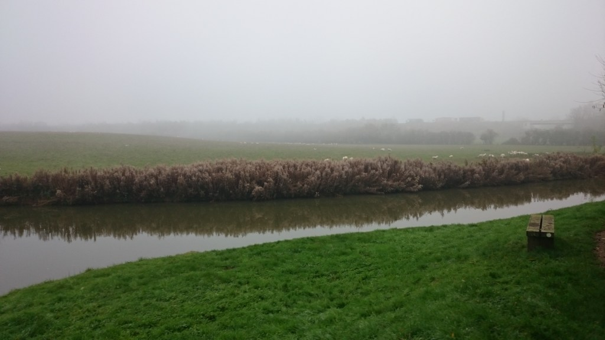

 

\[caption id="attachment\_225" align="alignnone" width="1024"\] Running along the Thames, Oxford UK © Hareesh\[/caption\]

I have _not yet_ run a marathon. I am preparing to run my first marathon in 2016, here in the U.K. I am not sure I will want to continue participating in races later on,  or may be continue on to ultra-marathons, but nothing yet planned. So, given that scope and context, the following posts are a collection of information fundamentally for my own preparation. I will publish each post as I learn and train.

<!--more-->

Whenever I prepare for an exam or interview, I make notes as I read through a number of resources and practice mock-tests. It helps me structure my thinking and aids me in remember stuff in a logical order. Sharing those personal training notes here serves a secondary purpose of helping other first-timers in navigating a plethora of information on marathon running. Also, I think it might be used to gain some feedback from experienced and build on their words of wisdom.

So, here they are - all the (future) posts. As I publish a post, I will add a hyperlink to it below. Please leave a comment to suggest anything I missed and should focus on learning.

### **Table of Contents**

- **Why I Am Running A Trail Marathon**
    - Why a Marathon
    - Why a Trail Marathon
- **Equipment for Trail running**
- **Preparing the body for trail marathon running**
    - Trail running techniques
    - Fueling and rebuilding
    - Anatomy and marathon running
    - Dealing with Injuries
    - Recovery
    - Cold showers
    - Stretching
    - Sleep
    - Mindfulness running
- **Preparing the mind for trail marathon running**
- **Training routine for trail marathon**
    - Beginner
    - Intermediate
- **Dealing with affects on Time, money, relationships,  and so on**
- **Techniques and terminology**
    - Interval training
        - Extensive interval training
        - Intensive interval training
    - Cadence and the Running form
    - Tempo-running
    - Run-and-Play (reference to Velocity)
        - Extensive run-and-play
        - Intensive run-and-play
    - Strike (fore-foot, mid-foot, rear-foot)
    - Warming up
    - Cooling down
    - Gait
    - Pace
    - Speed
- **Miscellaneous musings**
    - Pain vs. suffering
    - Speed vs. distance
    - Music vs. nature
