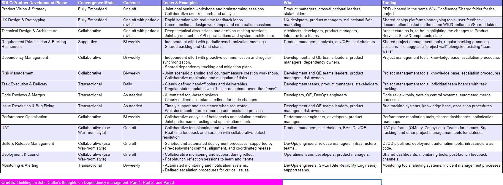

John Cutler's insightful ideas on convergence modes ([Part 1](https://cutlefish.substack.com/p/tbm-261-dependencies-in-faster-growing), [Part 2](https://cutlefish.substack.com/p/tbm-262-dependencies-in-faster-growing), and [Part 3](https://cutlefish.substack.com/p/tbm-264-dependencies-in-faster-growing?utm_source=profile&utm_medium=reader2)) in product development especially in handling dependencies effectively, offered a helpful perspective for understanding how collaboration styles affect project outcomes. John proposes four different modes/ways of working: Fully Embedded, Collaborative, Supportive, Transactional. And suggests that, to “make dependency management easier, you should ask yourself: "What type of working model SHOULD we use for this work?". This struck a chord with me. In the past few years, especially in 2023, I personally experimented with two modes for two different projects: one project that integrated different skillsets into a single, unified, cross-functional, and fully embedded team, and the other that relied on transactional ways of working supported by a framework of project management processes. Based on this personal experience, I asked myself a question: if you decide on a particular mode of convergence at the outset of a project, do the different phases require a dynamic shift between full immersion and focused transactional interactions?

This post builds on John's framework by suggesting convergence modes at different phase/step of the product development. By knowing when to "lean in" for deep collaboration and when to use efficient transactional interactions, we can achieve a new level of project agility and success.

**The Convergence Spectrum:**

Think of a journey through the different stages of product development - from vision and strategy to deployment and optimization. At each stage, the best kind of collaboration changes slightly. This table maps out this area:

This dynamic way of collaborating offers several benefits:

- Increased adaptability: Teams can quickly adapt to changing needs by changing their level of engagement.

- More efficiency: Transactional interactions reduce unnecessary overhead for routine tasks.

- Better focus: Deep collaboration flourishes during key phases like strategy and design, ensuring focused attention.

- Higher team morale: A balanced approach respects individual independence while creating cross-functional harmony.

Using the convergence spectrum effectively requires active leadership, clear communication, and a cultural change towards supporting collaborative flexibility.
