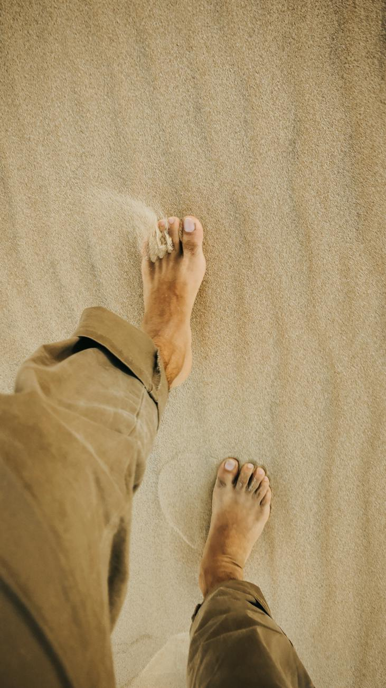

<figure>

<figcaption>

Photo by Jose Aragones on [Pexels.com](https://www.pexels.com/photo/crop-barefooted-person-walking-on-sandy-beach-3884710/)

</figcaption>

</figure>

**Hi Everyone,**

I took a couple of days off from work and spent some time **Coding**, catching up with [Rach](http://caddisfly.uk), and generally getting ready to launch a newsletter focusing on my experiences as a first-gen expat in a new country. After launching into Jan, taking a couple of days off has been good to get perspective. There's a general sense that companies are struggling, with the pendulum swinging back from inordinate cash at disposal to profitability and efficiencies. The tightening of belts is healthy, though uncomfortable for some. This leads to a lot of **reflection**, **defensiveness**, and even shutting down. I see this in every sphere, and perhaps something we can all do is acknowledge that we're in this together and need to look after ourselves more.

**On the work front**, the internal virtual conference was excellent. We had a tough few months last year with layoffs, reduced budgets, and so on, and I wanted to "turn the page" to shift the focus onto what we want to achieve. I believe we succeeded in that task, **opening up several conversation items** worth focusing on. The conversation has shifted from survival to betterment. Can we do better? Of course we can, and this week we'll solicit some formal feedback to build on our first experiment. Group Comms is excited to write a blog about it, which sounds great!

The other themes have been the conversation with Group about getting the H1 budget signed off, reviewing the demand planning process, and prepping for this week's alignment with our PMO leadership team (the Quad).

**On the personal front**, as mentioned above, the focus has been on catching up as a couple, taking long walks on Plymouth Hoe, starting a newsletter, and so on. In the midst of it all, I'm conscious that two things haven't been getting enough attention: exercise (though we had some walks, I feel I could get back to running) and catching up with mom and dad back home. That's this week's primary focus on the personal front.

**So, to summarize, the first week of Feb 2024 will see me:**

- Align the Quad on a number of items as a leadership unit to support our PMO group more effectively.

- Seek feedback on the recent P&T conference.

- Publish my 2024 objectives.

- Start the fortnightly newsletter on the Indian Diaspora.

- Publish PgM-related articles.

**Thanks for reading!**
