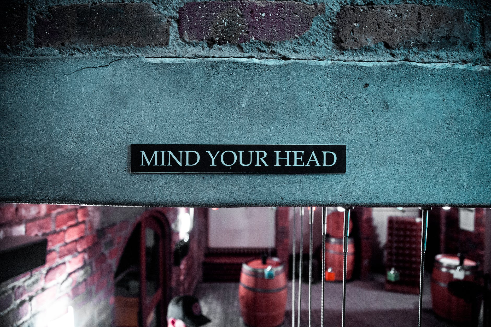

<figure>

<figcaption>

Photo by Arthur Brognoli on [Pexels.com](https://www.pexels.com/photo/mind-your-head-signage-2440530/)

</figcaption>

</figure>

**Meta reflections on writing these #weeklynotes**

While the underlying purpose has always been "to reflect on the past week, to go forward into the next week with intentions", I dabbled with multiple formats for writing these #weeknotes. I might never settle on one format, but I am drawing back on the inspiration from Philippa Perry's book, "[How to Stay Sane](https://www.wob.com/en-gb/books/philippa-perry/how-to-stay-sane/9781447202301?gclid=CjwKCAiAk--dBhABEiwAchIwkROoMznNyatukeks_rzLVnQ-kPay-K1TrEcSdaSzEFH16_wjGJG6gBoCYxMQAvD_BwE#GOR003808306)", for the foundational principles: that to remain stable yet flexible, coherent and yet able to embrace complexity, and to thrive in this world, these #weeknotes help me in: a) self-observation, b) relating to others, c) managing stress (as the right kind of stress creates positive stimulation), and d) listening/amending the personal narrative. While I chop the reflections into personal/work boxes, the key themes are the same.

**Personal Reflections:**

I admit that I struggled to market my newsletter, [Des/Pardes](https://open.substack.com/pub/hareesh/p/makara-sankranti-at-our-southwest?r=cmhoq&utm_campaign=post&utm_medium=web). The narrative I had in my mind was that I don't have anything worth sharing or that I didn't have the knowledge/context and so on. Similarly I am thinking whether to move my posts on Technical Programme Management to Substack too (at least that's something I do know about?). That's the sort of mental narrative, and is starting to drag me down a bit. I know I could do with speaking to someone about these and that it takes time, but it's quite a humbling experience to feel how little I know.

Coding is going well and I am thoroughly enjoying the system design concepts, associated architectural know-how, and how those attribute to my career. I spent a good amount of time in crafting my CV in line with the tasks outlined in the bootcamp. The personal narrative is also in the similar vain: that I like learning new stuff, but that is driven from a place of being an imposter rather than confidant curiosity.

**Professional Reflections:**

I [read a quote that resonated deeply](https://www.linkedin.com/posts/myles-ogilvie-220592b_leancontrol-bvssh-activity-7166406134931668993-GwCI?utm_source=share&utm_medium=member_desktop) as it was exactly what we were grappling at the moment: the rigidity threatened by some sort of "board", the perceived loss of autonomy, the concern of bureaucracy, and so on. I wish for the nimbleness that is supported by conversations. Conversations are at the core of being agile (because we need to shift together), and coming from a programme manager, it might sound self-deprecating to say processes come secondary. They do, and in fact, processes should support the conversations, the feeling of "being on the same page", and the togetherness. Some of my best projects and most successes, in fact, all of them, are built on just having conversations. We did that exact same thing last week and in an hour we were able to solve a prioritisation challenge that I mentioned in my last [#weeknotes](https://hareesh.co/2024/02/19/s2e07-weeknotes-12-18-feb24/).

Can we do that more?

**Looking Ahead:**

This coming week marks the end of the 2nd month in 2024. WTF! Sorry, but that's the genuine feeling of astonishment at the pace within which life's progressing. But time flies when you're enjoying it, yeah?

- I am in lovely London meeting some estranged colleagues.

- Volunteering as a team at a local books charity.

- And have my performance review and get sign off on the 2024 ambitions.

- Sharing the next post with technical programme managers on the [craft of execution](https://hareesh.co/tag/execution/).

See you next week!

