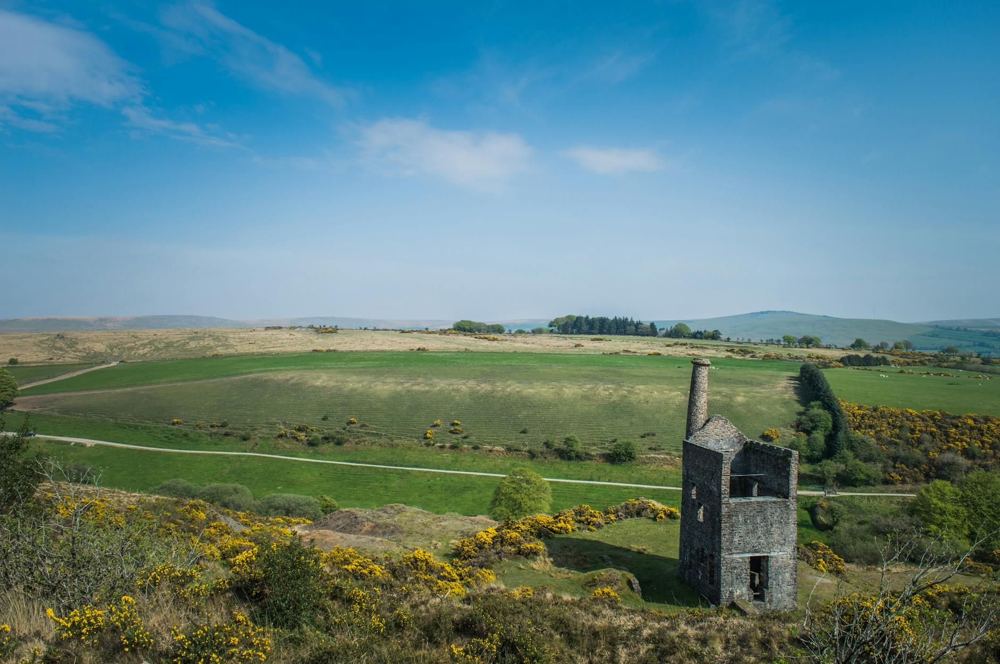

<figure>

<figcaption>

Photo by Mark Lee on [Pexels.com](https://www.pexels.com/photo/an-aerial-shot-of-the-wheal-betsy-14306379/)

</figcaption>

</figure>

I am sorry that I missed sharing the last two weeks of weekly notes. A pesky scaphoid fracture and a possible diabetes diagnosis threw a wrench in my plans. While reflecting on this (admittedly with some grumbling!), I realised it's no excuse to stop sharing. I'm committed to continuing to deliver thoughtful, useful, and enjoyable reflections for my curious readers (if you're one of them ;-P).

## **Work Stuff**

Here's a bulleted list, just as you like it:

- **Strategic Planning:** We're diving deep into the "why" behind several projects under consideration for the next three years. It's like delving into the mechanics of a strategy game, but even more fun! We're asking crucial questions: Why are we doing this? Why now? What will happen a year from now? [Budget constraints](https://neilojwilliams.net/week-notes-22-28-april-2024/) and a feeling that tech spending isn't delivering the best returns are leading to interesting "right-sizing" discussions. This might deserve a dedicated post later, but here are some of the questions I'm exploring:
    - Can this investment be directly tied to a measurable objective?
    
    - Are there any technology gaps hindering our strategic goals?
    
    - Can we consolidate or reduce complexity while enabling growth?
    
    - Are these investments flexible (not the technology itself, but the decision to invest)?

- **Demand Planning:** While planning for the next three years, we're also strengthening our demand planning process. This ensures we choose the right projects at the right time with the right resources, especially with tighter budgets, leaner teams, and increased demand. Choosing the right focus is crucial. You can only be so proficient in delivery and cross-functional work (and delivery management is a practice, there's _always_ room to improve). If you're not working on the right thing, all your effort is wasted.

- **Delivery Practice:** We continue to refine our delivery skills, with a heavy focus on [Program Management](https://hareesh.co/2024/01/21/managing-t-programme-managers/) fundamentals.

## **Personal Stuff**

We're fortunate to live in a [beautiful location](https://youtu.be/8Hj5ugyl0ws), just a 15-minute drive from stunning beaches. We're enjoying this, even with the persistent rain. Our child is taking the bus to school, my wife's [start-up](https://caddisfly.uk/) is taking shape, and the rain isn't dampening our spirits. Life is certainly challenging, but also rewarding.

The biggest challenge? Missing time with my parents and siblings who live far away. Being an immigrant is a constant exercise in cultural adaptation, which can be [emotionally draining](https://www.verywellmind.com/what-is-code-switching-5270156). I don't feel inauthentic, but social norms, expectations, and understandings differ across cultures, and sometimes things get lost in translation. As a small step towards bridging this gap, we're planning a month-long trip to India. Nothing is set in stone yet, but it's something I'm very much looking forward to!

## **Looking Ahead**

Next week, I'll be focusing on asking more "awkward assurance-type" questions, both within and outside the PMO. I'll also be working on measuring value and making progress on our soggy garden (at home and at work - you know what I mean!)

**Onwards!**
